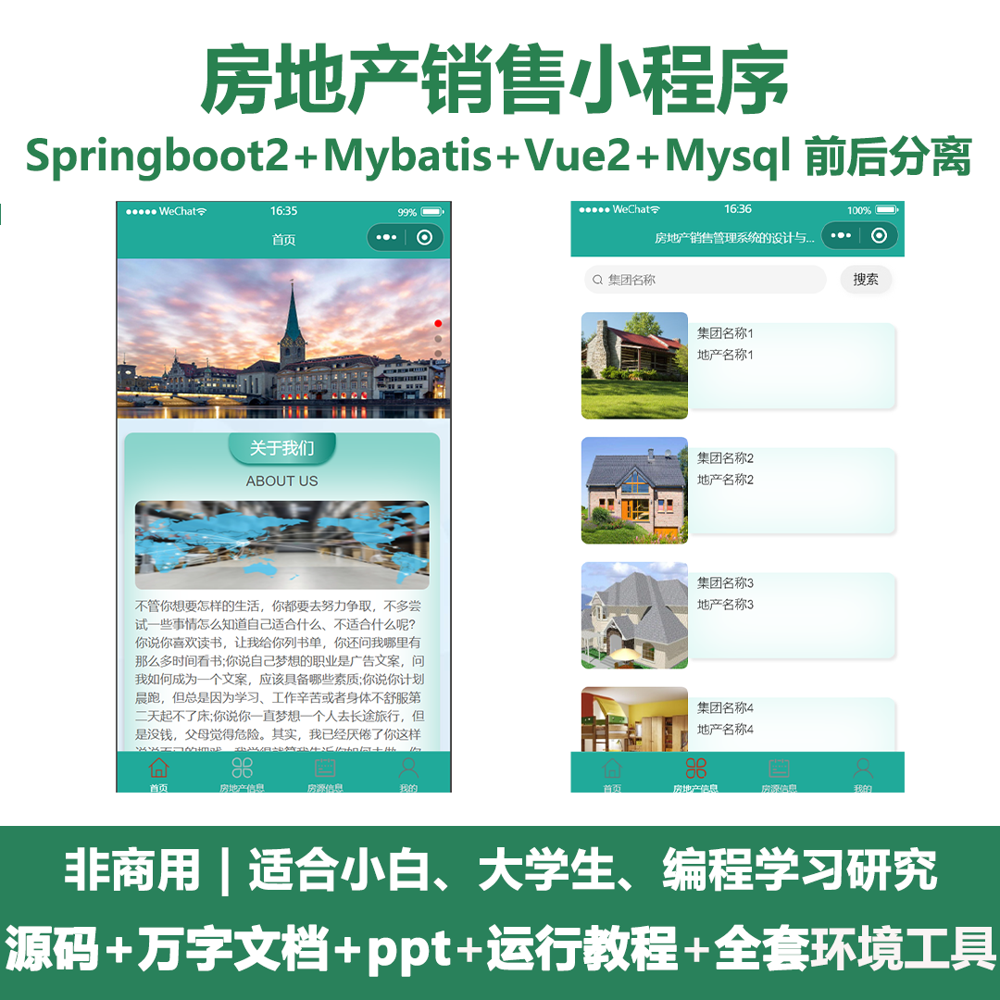
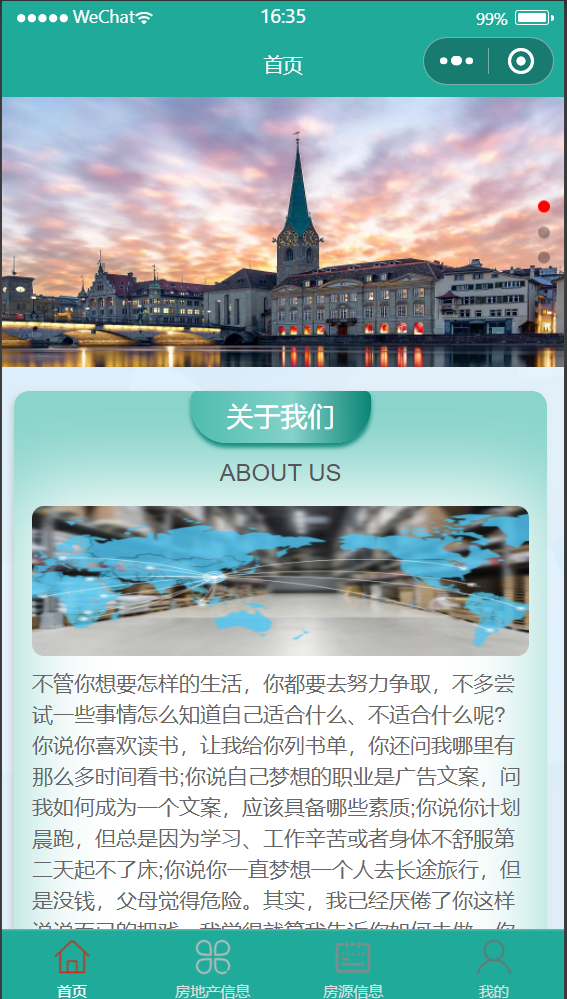
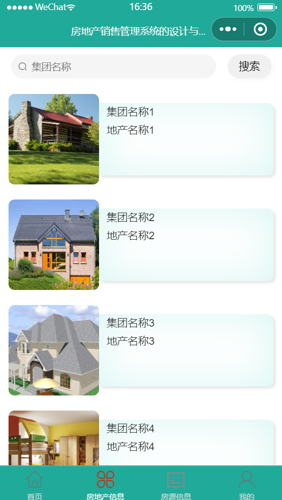
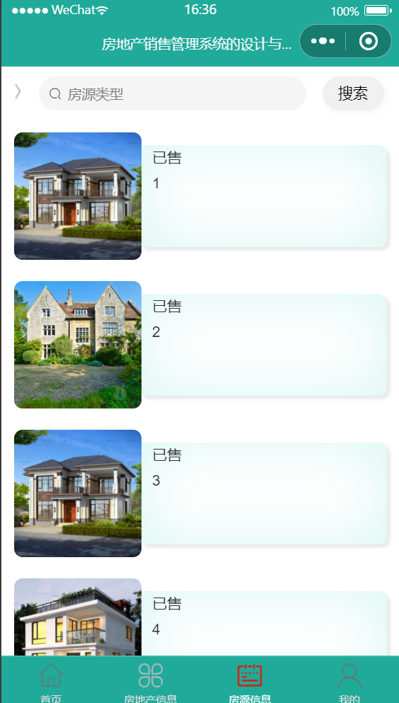
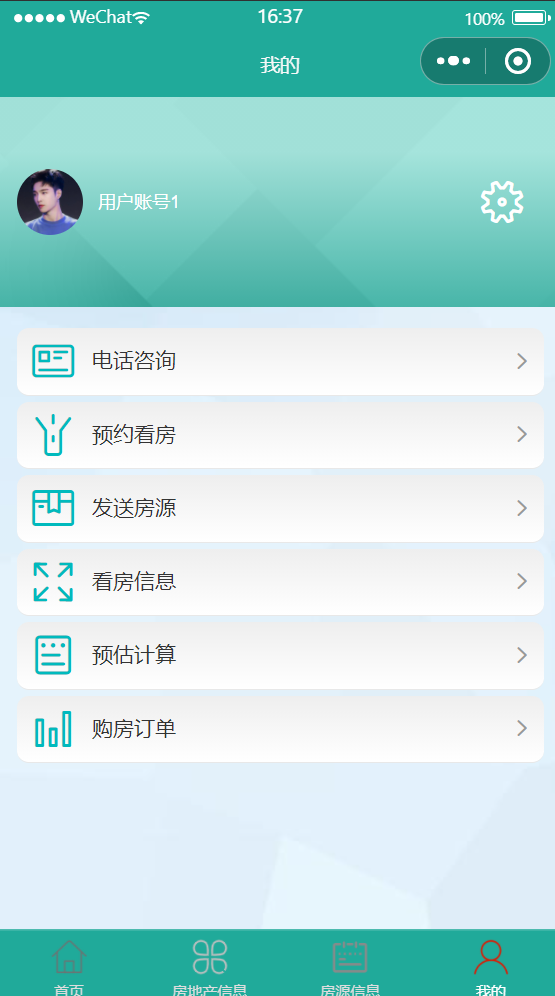
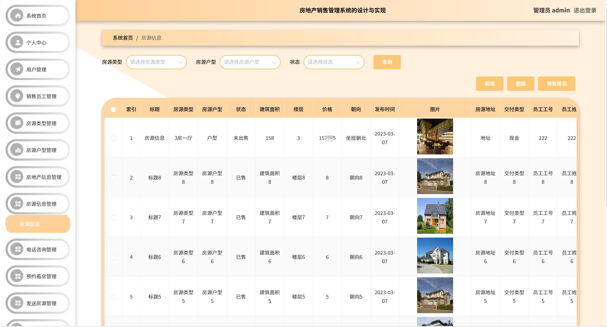
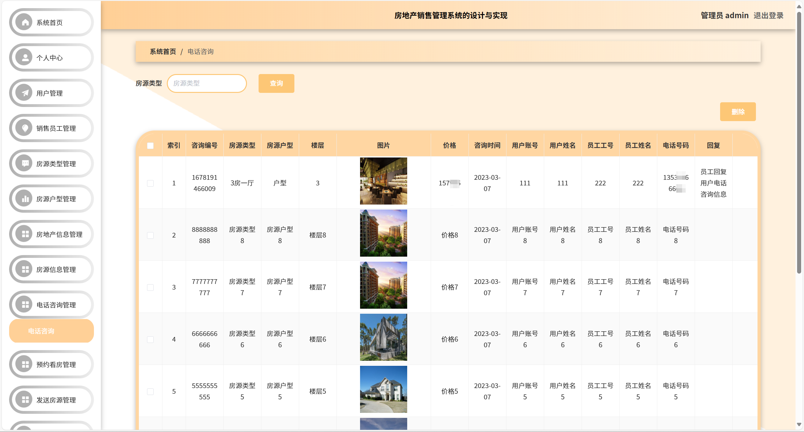
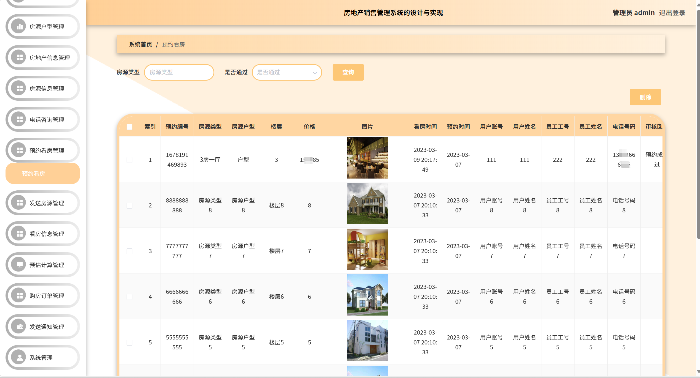
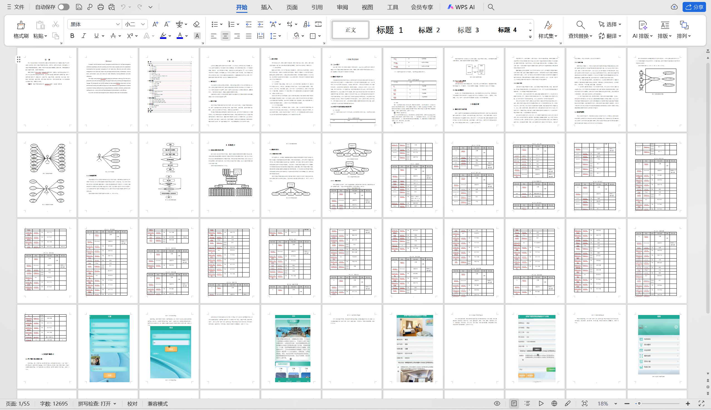

# mpweixinA056
mpweixinA056房地产销售微信小程序LW+PPT
 
## 查看主页获取源码

### 一、关键词
房地产营销，房源售卖，房产销售微信小程序

### 二、作品包含
源码+数据库+万字设计文档+PPT+全套环境和工具资源+本地部署教程

### 三、项目技术
前端技术： Html、Css、Js、Vue2.0、Element-ui、uniapp
后端技术：Java、SpringBoot2.0、MyBatis

### 四、运行环境（以下版本亲测，其他版本兼容性请自行测试）
开发工具：IDEA/eclipse  + VSCODE + 微信开发者工具 + HBuilder X

数据库：MySQL5.7

数据库管理工具：Navicat10以上版本

环境配置软件： JDK1.8 + Maven3.6.3

前端Nodejs：14

浏览器：谷歌浏览器

### 五、项目介绍
项目编号：mpweixinA056

课题主要采用Uni-weixin、springboot架构技术，前端以小程序页面呈现给用户，结合后台java语言使页面更加完善，后台使用MySQL数据库进行数据存储。微信小程序主要包括用户、销售员工、房源户型、房地产信息、房源信息、电话咨询、预约看房、发送房源、看房信息、预估计算、购房订单、发送通知等功能，从而实现智能化的管理方式，提高工作效率。 

### 六、运行截图

